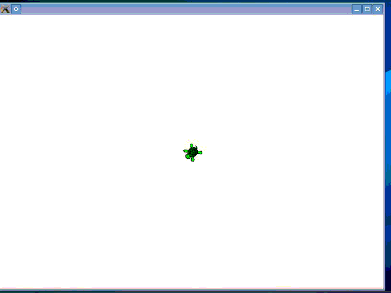

Tortuga
=======

Simple C file to introduce new students to programming. It emulates the Logo language turte.

I did it for my lectures at Universitat Politècnica de Catalunya, so the name of the constants
and functions are in spanish language.

It works with any C compiler, and requires [Simple Directmedia Layer (SDL) v1.2](http://www.libsdl.org) to work.

Building instructions for Ubuntu
--------------------------------
1. Install GCC and SDL, if not already installed: `sudo apt-get install build-essential libsdl1.2-dev`
2. Compile the example file in the same folder as tortuga.h with -lSDL and -lm options:
`gcc example.c -o example -lSDL -lm`
3. Run the binary: `./example`

And, voilà! Your turtle is drawing your screen:

Functions and constants reference
---------------------------------
* `void inicializar()`
  + Starts the Tortuga environment.
* `void finalizar()`
  + Finishes the Tortuga environment.
* `void girar(float grados)`
  + Rotates the turtle.
  + Parameters:
      - `float grados`: the number of degrees to rotate the turtle. If `grados` is positive, turtle will rotate
      to its left. Otherwise, it will rotate to its right.
* `void avanzar(float distancia)`
  + Makes turtle to go ahead.
  + Parameters
      - `float distancia`: number of steps to advance.
* `void posicion_inicial(float posX, float posY)`
  + Sets the position of the turtle in the screen.
  + Parameters
      - `float posX`: the X position of the turtle.
      - `float posY`: the Y position of the turtle.
* `void angulo_inicial(float grados)`
  + Sets the angle of the turtle.
  + Parameters
      - `float grados`: the new angle of the turtle, in degrees.
* `void punta_lapiz(int color, int grosor)`
  + Sets the properties of the pencil.
  + Parameters
      - `int color`: the color of the pencil. It can be one of the next constants:
        `BLACK`, `WHITE`, `RED`, `BLUE`, `GREEN`, `WHITE`
      - `int grosor`: the widht of the pencil.
* `void estado_lapiz(int estado)`
  + Sets the status of the pencil.
  + Parameters
      - `int estado`: the status of the pencil. It can be one of the next constants: `PEN_DOWN` (the turtle draws
        while it walks), `PEN_UP` (the turtle does not draw when it walks).
* `void velocidad_tortuga(int velocidad)`
  + Sets the speed of the turtle.
  + Parameters
      - `int velocidad`: the speed of the turtle. It can be one of the next constants, ordered from slowest to fastest:
         `VELOCIDAD_LENTA`, `VELOCIDAD_MEDIA`, `VELOCIDAD_RAPIDA`, `VELOCIDAD_MAXIMA`
* `void puntero_lapiz(int visible)`
  + Sets the visibility of the turtle.
  + Parameters
      - `int visible`: it can be one of the next constants: `ON` turns the turtle visible, `OFF` turns the turtle
      invisible

Si te gustan mis aportaciones a github, quizás te gustará mi libro [Del bit a la Nube](http://www.xaas.guru/del-bit-a-la-nube/)
